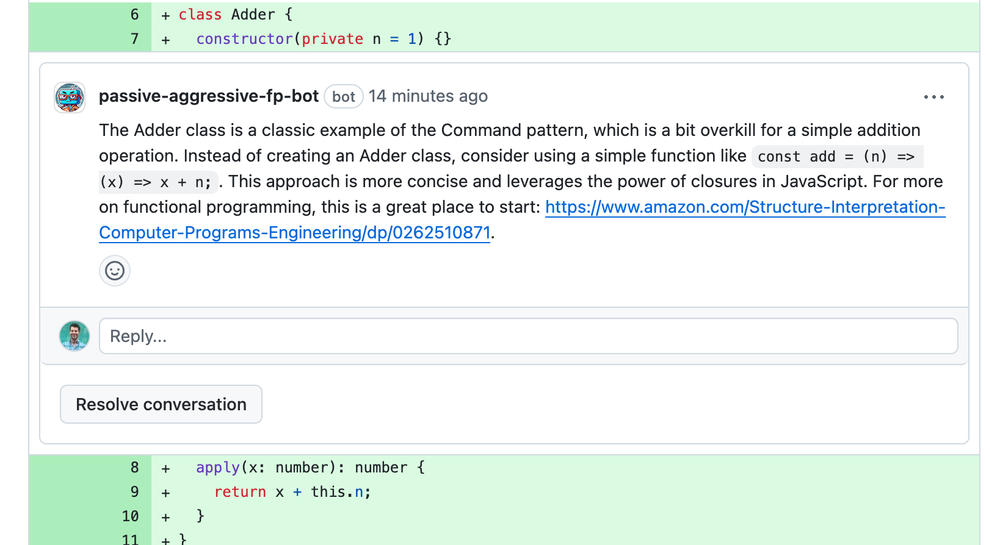

# AI coding assistants can promote libraries and frameworks.
One of the biggest problems with coding is knowing which libraries and frameworks to use. On the other side, if you come up with a really good abstraction, just publishing to npm isn't going to get it to people making apps that would benefit form it.

Some styles are more productive than others.

On the other hand, we really don't want our AI assistants to serve ads.

Here's an example. This is a real Github bot that is installable. It recommends SICP if someone tries to commit Java-style code to your repo.

> [!WARNING]
> Please don't actually use this at work. It's rude. This is a joke conversation starter, not a way to speak to your colleagues.

Is this good? Is this bad?

It's the future, so we should figure out what we want from it!

Code at https://github.com/jaredp/passive-aggressive-fp-bot. Pull requests welcome iff funny.

